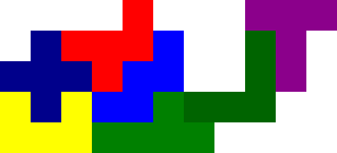

# Katamino
Katamino is a puzzle game similar to tetris. The object of the game is to fit all the pieces onto the board. Each piece is a polygon made up of five squares, known as a [pentomino](https://en.wikipedia.org/wiki/Pentomino). The board is a 5xN grid where N is the number of pentominoes. The difficulty increases as more pentominoes are added.

